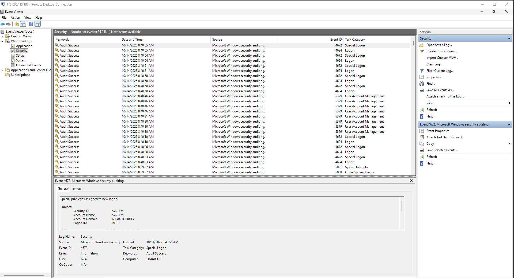
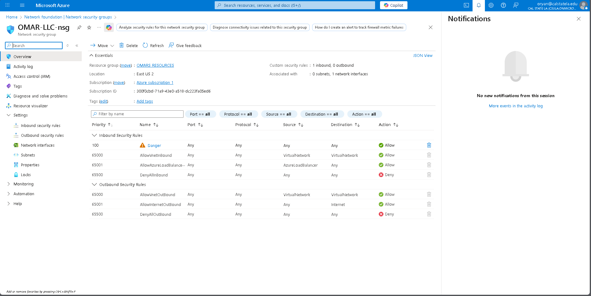
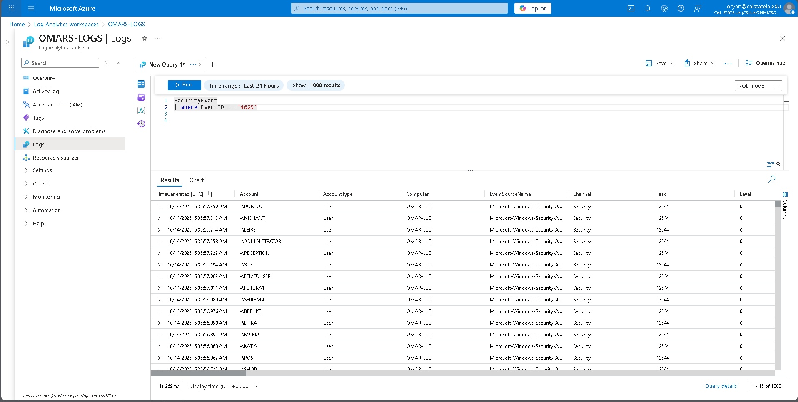
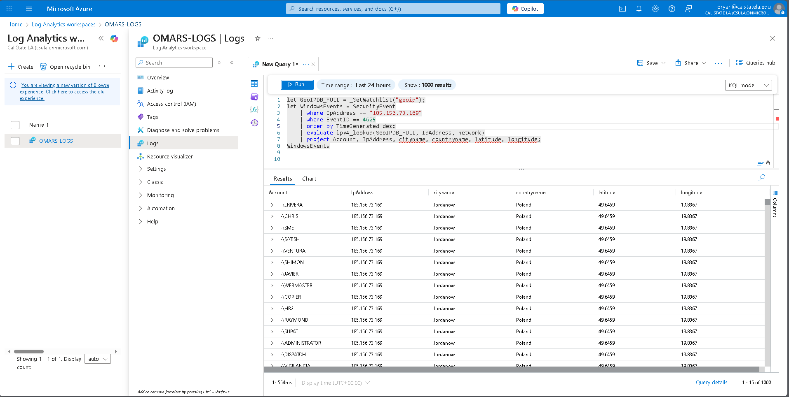
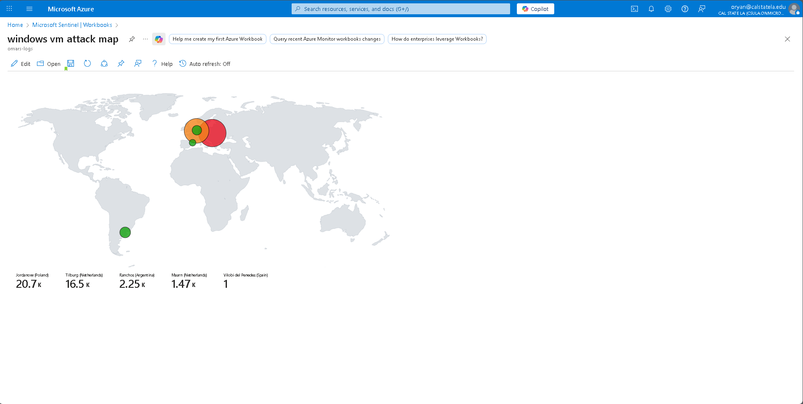

# Azure Honeypot & SIEM Lab

## Objective
In this solo project, I deployed a Windows 10 honeypot in Azure to monitor and analyze unauthorized RDP login attempts. My goal was to capture attack activity, enrich the data with geographic context, and visualize patterns of malicious behavior using Microsoft Sentinel. This project gave me hands-on experience with cloud security, SIEM operations, and threat detection.

---

## What I Did

**Azure VM Deployment and Configuration**  
I created a Windows 10 virtual machine in Azure and configured its Network Security Group to allow all inbound traffic. I also disabled the Windows Firewall on the VM to make it an open honeypot for testing attack activity.

---

**Capturing Attack Activity**  
I simulated attack activity by attempting multiple failed logins with a test username. These attempts were recorded in the Windows Security logs.  

**Screenshot 1:** Click on the image to zoom in and view the details more clearly.

---

**Inspecting Access Control Rules**  
I configured the inbound and outbound rules in the VM’s Network Security Group to allow all traffic from any source and any port to reach the VM.

**Screenshot 2:**  Click on the image to zoom in and view the details more clearly.

---

**Querying Logs in Sentinel**  
Once logs were centralized in the Log Analytics Workspace via Microsoft Sentinel, I ran KQL queries to analyze failed login attempts.  

**Screenshot 3:** Click on the image to zoom in and view the details more clearly.

---

**Enriching Logs with Geographic Data**
I imported a GeoIP watchlist into Sentinel and used it to enrich the logs with location data based on attacker IP addresses.

**Screenshot 4:** Click on the image to zoom in and view the details more clearly.

---

**Visualizing Attacks on a Map**
Finally, I created a Sentinel workbook to map attack activity geographically. This allowed me to see the origin of brute-force attempts in a visual, interactive format.

**Screenshot 5:** Click on the image to zoom in and view the details more clearly.

## Skills Gained
- Deploying and configuring cloud-based honeypots
- Centralized log collection and SIEM setup
- Writing KQL queries to detect and analyze attacks
- Enriching security data with GeoIP threat intelligence
- Visualizing attack patterns through dashboards and maps
- Understanding attacker behavior and cloud security principles

## Tools Used
- Microsoft Azure (VMs, Network Security Groups)
- Microsoft Sentinel & Log Analytics Workspace
- Kusto Query Language (KQL)
- GeoIP watchlist for location enrichment
